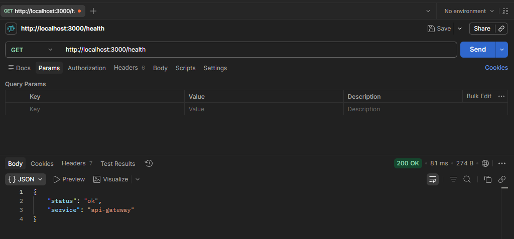
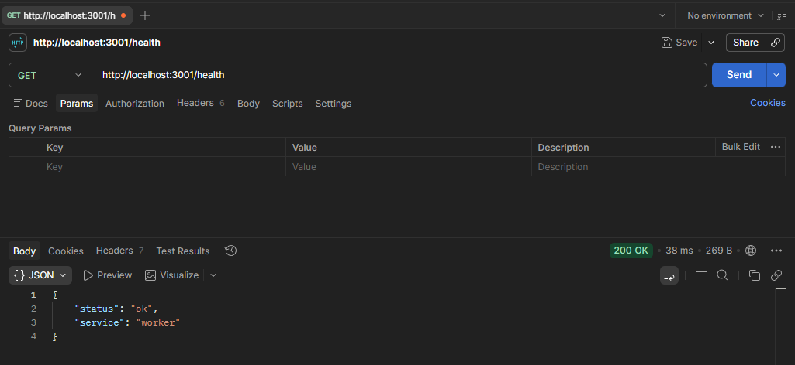
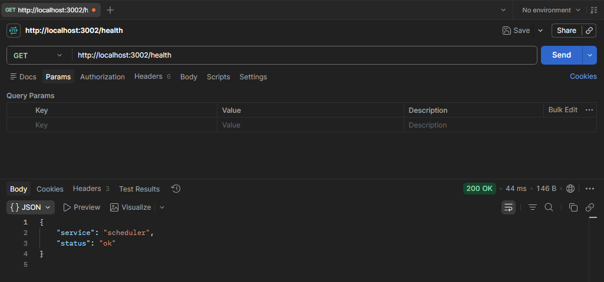
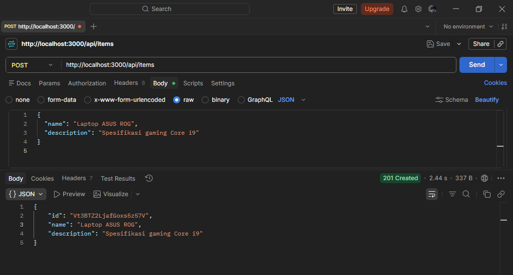
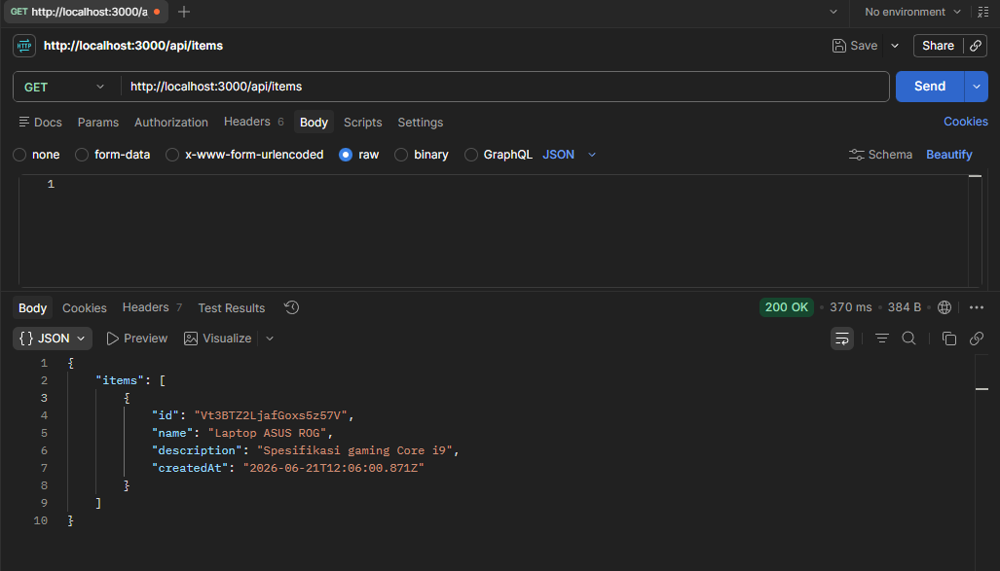
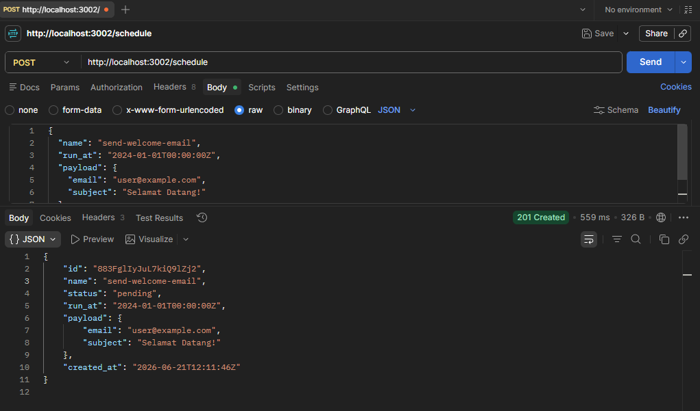
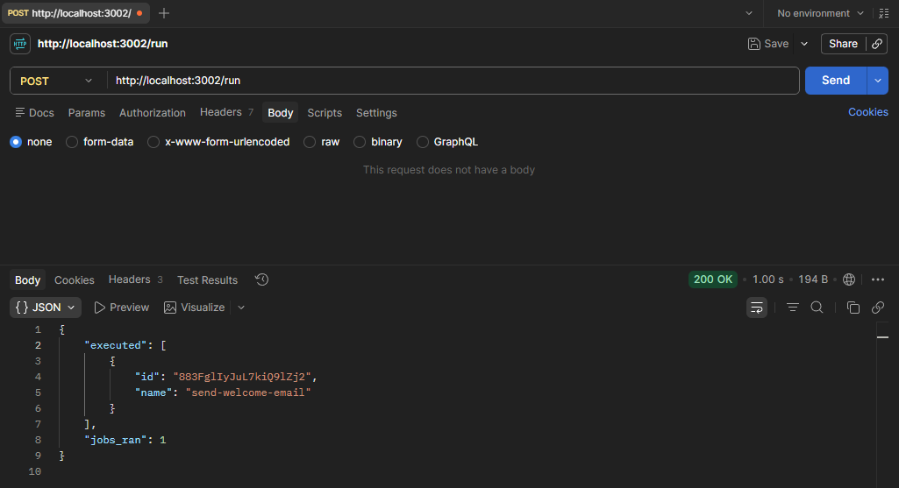
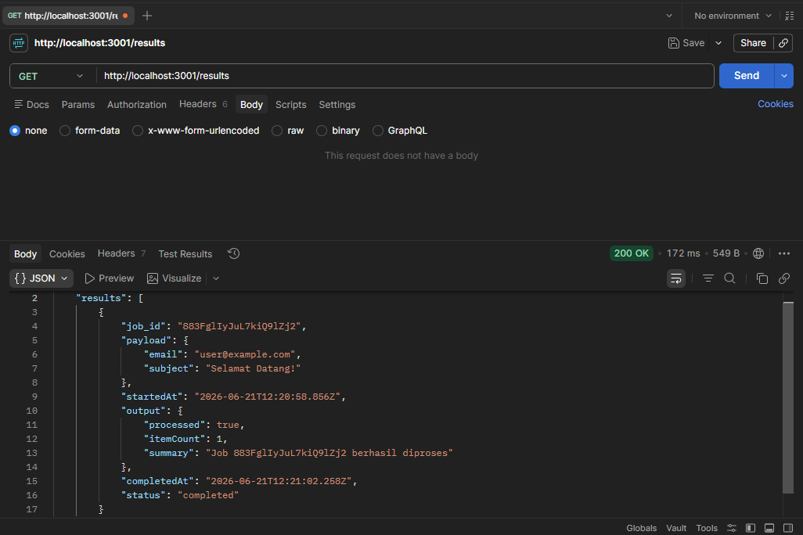

# Cloud Task Engine: GCP Microservices Platform

This project is a serverless **microservices** architecture deployed to Google Cloud Platform (GCP). It leverages Node.js for the API Gateway and Worker services, and Go for the Scheduler service. Infrastructure provisioning is managed via Terraform (IaC), and automated CI/CD deployment is handled by GitHub Actions. The system is designed to run entirely for free under the GCP Free Tier limit.

## System Architecture

```
┌──────────────────────────────────────────────────────────────┐
│                         Developer                            │
│                      git push main                           │
│                      └──────┬────────────────────────────────┘
│                             │
│                             ▼
│ ┌──────────────────────────────────────────────────────────┐ │
│ │                    GitHub Actions                        │ │
│ │  ┌─────────────┐   ┌──────────────┐   ┌────────────────┐ │ │
│ │  │  Terraform  │──>│ Docker Build │──>│  Deploy Cloud  │ │ │
│ │  │   Apply     │   │ & Push Image │   │      Run       │ │ │
│ │  └─────────────┘   └──────────────┘   └────────────────┘ │ │
│ └───────────────────────────┬──────────────────────────────┘ │
└─────────────────────────────┼────────────────────────────────┘
                              │
                              ▼
┌──────────────────────────────────────────────────────────────┐
│                      GCP Project                             │
│                                                              │
│   ┌─────────────────────────────────────────────────────┐   │
│   │              Artifact Registry                      │   │
│   │         (Stores Docker Images)                      │   │
│   └─────────────────────────────────────────────────────┘   │
│                                                              │
│   ┌──────────────┐                     ┌──────────────────┐  │
│   │ API Gateway  │                     │    Scheduler     │  │
│   │  Cloud Run   │                     │   Cloud Run      │  │
│   │  (Node.js)   │                     │      (Go)        │  │
│   │              │                     │                  │  │
│   │ CRUD items   │                     │ Manages schedule │  │
│   └──────┬───────┘                     └────────┬─────────┘  │
│          │                                      │            │
│          │                                      ▼            │
│          │                             ┌──────────────────┐  │
│          │                             │   Cloud Tasks    │  │
│          │                             │     Queue        │  │
│          │                             └────────┬─────────┘  │
│          │                                      │            │
│          │                                      ▼            │
│          │                             ┌──────────────────┐  │
│          │                             │    Worker        │  │
│          │                             │   Cloud Run      │  │
│          │                             │   (Node.js)      │  │
│          │                             │                  │  │
│          │                             │ Processes job    │  │
│          │                             └────────┬─────────┘  │
│          │                                      │            │
│          └─────────────────┬────────────────────┘            │
│                            │                                 │
│                            ▼                                 │
│                  ┌─────────────────┐                         │
│                  │    Firestore    │                         │
│                  │                 │                         │
│                  │  /items         │                         │
│                  │  /job_results   │                         │
│                  │  /scheduled_jobs│                         │
│                  └─────────────────┘                         │
└──────────────────────────────────────────────────────────────┘
```

All Cloud Run services are configured with `min_instances = 0` (scale to zero), meaning they scale down to zero instances when idle to prevent incurring any billing costs.

## Service Breakdown

* **API Gateway (Node.js)**: The main entry point. Receives external HTTP requests and performs CRUD operations on the `items` collection in Firestore (Local Port: 3000).
* **Worker (Node.js)**: Asynchronously processes heavy background jobs and saves the results in the Firestore `job_results` collection (Local Port: 3001). This service is private and only accessible by authorized service accounts (like Google Cloud Tasks).
* **Scheduler (Go)**: Stores scheduled tasks in the Firestore `scheduled_jobs` collection. When triggered periodically via the `/run` endpoint, it queries due tasks and dispatches them to the **Google Cloud Tasks Queue** using OIDC tokens for secure and reliable job execution (Local Port: 3002).

## Project Directory Structure

```
cloud-task-engine/
│
├── README.md
├── start.bat                   Windows batch script to run all services locally
├── start_services.ps1          PowerShell helper script for local execution
├── key.json                    GCP Service Account credentials file (gitignored)
│
├── terraform/                  Infrastructure as Code (IaC) configuration
│   ├── main.tf                 Main module connector
│   ├── variables.tf            Input variable definitions
│   ├── outputs.tf              Cloud Run output URLs
│   └── modules/                Sub-modules (Cloud Run, Firestore, IAM, Registry)
│
├── services/                   Application Source Code
│   ├── api-gateway/            API Gateway Service (Node.js) + `.env.example`
│   ├── worker/                 Background Worker Service (Node.js) + `.env.example`
│   └── scheduler/              Scheduler Service (Go) + `.env.example`
│
└── .github/
    └── workflows/
        └── deploy.yml          CI/CD automated deployment workflow to GCP
```

---

## GCP Deployment Guide

Follow these step-by-step instructions to deploy the entire microservices stack to your Google Cloud Platform account.

### Step 1: Prepare GCP Project
1. Log in to your GCP account via terminal using the gcloud CLI.
2. Create a new GCP project using `gcloud projects create YOUR-PROJECT-ID`.
3. Set your active project using `gcloud config set project YOUR-PROJECT-ID`.
4. Enable billing for the project in the GCP Console to allow resource provisioning.

### Step 2: Provision Infrastructure with Terraform
1. Navigate to the `terraform` directory in your workspace.
2. Copy the variables template using `cp terraform.tfvars.example terraform.tfvars`.
3. Edit the `terraform.tfvars` file and specify your configuration (enter `project_id`, `region`, and `environment`).
4. Initialize Terraform: `terraform init`.
5. Provision resources: `terraform apply` (this creates Firestore, Artifact Registry, IAM roles, and sets up Cloud Run placeholder services).

### Step 3: Setup GitHub Actions CI/CD Secrets
Deployments are automated on git pushes via GitHub Actions using Workload Identity Federation (WIF) for keyless GCP authentication.
1. Create and configure a Workload Identity Pool in your GCP project using gcloud CLI.
2. Copy the resulting WIF provider resource path.
3. Open your GitHub repository, go to Settings -> Secrets and variables -> Actions.
4. Add the following repository secrets:
   * `GCP_PROJECT_ID`: Your GCP Project ID.
   * `WIF_PROVIDER`: Your WIF provider resource path.
   * `WIF_SERVICE_ACCOUNT`: The email address of the GitHub Actions service account created by Terraform (e.g. `github-actions-sa@your-project-id.iam.gserviceaccount.com`).

### Step 4: Push and Deploy
Commit and push your changes to your main branch to trigger the automated CI/CD deployment:
```bash
git add .
git commit -m "feat: complete configuration and deploy infrastructure"
git push origin main
```
Track the build and deployment progress under the **Actions** tab of your GitHub repository.

---

## Local Setup & Installation

There are several ways to spin up the Firestore database and run the microservices locally. Choose the setup option that best fits your local environment.

### Main Prerequisites
* Node.js v18 or newer
* Go v1.21 or newer

### Option A: Connecting directly to GCP Firestore (Using key.json)
This option is recommended if you want to test database writes/reads against your real GCP Firestore instance from your local computer.

1. Go to **GCP Console** -> **IAM & Admin** -> **Service Accounts**.
2. Select your service account (e.g. `cloud-run-sa` or create a new one with the `Cloud Datastore User` role).
3. Click the **Keys** tab -> **Add Key** -> **Create new key** -> select **JSON**.
4. Save the downloaded credential file as **`key.json`** inside the root folder of this project.
5. Install service dependencies:
   ```bash
   cd services/api-gateway && npm install && cd ../..
   cd services/worker && npm install && cd ../..
   cd services/scheduler && go mod tidy && cd ../..
   ```
6. Spin up all services automatically by double-clicking the **`start.bat`** file in the root folder, or running this in PowerShell:
   ```powershell
   .\start.bat
   ```

### Option B: Using Google Cloud SDK (Firestore Emulator)
A completely offline and free option utilizing the built-in emulator from the Google Cloud CLI.

1. Ensure the gcloud CLI is installed on your computer.
2. Install the emulator component:
   ```powershell
   gcloud components install cloud-firestore-emulator
   ```
3. Start the local emulator:
   ```powershell
   gcloud emulators firestore start --host-port=localhost:8090
   ```
4. In separate terminal windows, launch each service with the emulator host environment variable:
   * **API Gateway**:
     ```powershell
     cd services/api-gateway
     $env:FIRESTORE_EMULATOR_HOST="localhost:8090"
     npm.cmd start
     ```
   * **Worker**:
     ```powershell
     cd services/worker
     $env:FIRESTORE_EMULATOR_HOST="localhost:8090"
     npm.cmd start
     ```
   * **Scheduler**:
     ```powershell
     cd services/scheduler
     $env:FIRESTORE_EMULATOR_HOST="localhost:8090"
     $env:GCP_PROJECT="local-dev"
     $env:WORKER_URL="http://localhost:3001"
     # QUEUE_PATH and CLOUD_RUN_SA_EMAIL are left blank in local testing
     go run main.go
     ```
     *(Note: In local testing, Go Scheduler automatically falls back to direct HTTP calls to the Worker since Google Cloud Tasks is a cloud-only resource. This keeps local development 100% offline and free).*

### Option C: Using Docker (Firestore Emulator)
An offline option if you do not want to install any local SDK binaries other than Docker.

1. Ensure Docker Desktop is running on your machine.
2. Spin up the official Google SDK container running the emulator:
   ```powershell
   docker run -d --name firestore-emulator -p 8090:8090 google/cloud-sdk:alpine gcloud beta emulators firestore start --host-port=0.0.0.0:8090
   ```
3. Connect your local services to the Docker container by setting the environment variable `$env:FIRESTORE_EMULATOR_HOST="localhost:8090"` before starting each process (refer to Option B for start commands).

### Option D: Using Node.js / firebase-tools (Firestore Emulator)
An offline option if you want to avoid installing the Google Cloud CLI or Docker.

1. Ensure Java v11 or newer is installed on your computer.
2. Run the Firebase emulator suite directly using npx:
   ```powershell
   npx firebase-tools emulators:start --only firestore
   ```
3. Connect your local services by setting `$env:FIRESTORE_EMULATOR_HOST="localhost:8090"` before running them (refer to Option B for start commands).

---

## Dashboard User Interface (Interactive Portfolio Hub)

This project features a premium, interactive scheduler dashboard built using pure HTML, custom Vanilla CSS, and state-driven Javascript. It serves as a visual portfolio piece designed to impress recruiters by adhering to strict high-end design aesthetics (avoiding generic template layouts, purple mesh gradients, and icon slops).

### Dynamic Theme Switcher HUD
The dashboard contains a floating control HUD that allows users to switch visual layouts, color spacing, and typographical structures on the fly across **three distinct visual directions**:
1. **Dark Editorial (T1)**: Strict monospace alignment, slate-navy tone, hairline borders, single neon cyan accent, left sticky sidebar navigation.
2. **Glassmorphism Bento (T2)**: Glass backdrop blur, glowing radial hover margins, indigo-blue gradient accent, floating header navigation.
3. **Swiss Minimalist (T3)**: Warm cream paper styling, 90-degree corners, off-black borders, brick-red typography, asymmetrical grids, and elegant serif numbers.

### Core Visual & Functional Features:
*   **KPI Metrics Cards**: Total, Pending, Success Rate, and Latency statistics utilizing monospaced digits and inline vector sparklines.
*   **Active Job Pipeline**: Real-time progress trackers for active runs, with options to trigger manual runs (`/run`) or cancel tasks.
*   **Log Auditor Table**: Job histories table with filter triggers by status/type, search box, pagination, and a client-side **Export CSV** download utility.
*   **Quick Schedule Drawer**: Slide-over panel containing JSON syntax verification for automated payloads.
*   **State Simulation HUD**: Force Skeleton Loading states, Empty states, and Error states instantly.

### Running the Dashboard Locally
1. Start the microservices (Option A, B, C, or D).
2. Spin up the dedicated static dashboard server:
   ```bash
   node dashboard/serve.js
   ```
3. Open **[http://localhost:3050](http://localhost:3050)** in your browser.
4. Toggle **Live Localhost API** in the HUD to let the dashboard poll task information directly from your running local Go Scheduler service.

---

## Postman Testing Documentation

Execute the following 8 testing steps in order inside Postman to verify the end-to-end functionality of your microservices:

### 1. Health Check: API Gateway
Verifies the API Gateway (Port 3000) is running locally.
* **Method**: `GET`
* **Request URL**: `http://localhost:3000/health`
* **Response**: `200 OK` with JSON body `{"status": "ok", "service": "api-gateway"}`.
* *Screenshot Reference*: 

### 2. Health Check: Worker
Verifies the Worker (Port 3001) is running locally.
* **Method**: `GET`
* **Request URL**: `http://localhost:3001/health`
* **Response**: `200 OK` with JSON body `{"status": "ok", "service": "worker"}`.
* *Screenshot Reference*: 

### 3. Health Check: Go Scheduler
Verifies the Go Scheduler (Port 3002) is running locally.
* **Method**: `GET`
* **Request URL**: `http://localhost:3002/health`
* **Response**: `200 OK` with JSON body `{"service": "scheduler", "status": "ok"}`.
* *Screenshot Reference*: 

### 4. Uji API Gateway: Create New Item
Creates a new document directly in your cloud Firestore instance.
* **Method**: `POST`
* **Request URL**: `http://localhost:3000/api/items`
* **Headers**: `Content-Type: application/json`
* **Body** (raw -> JSON):
  ```json
  {
    "name": "Laptop ASUS ROG",
    "description": "Spesifikasi gaming Core i9"
  }
  ```
* **Response**: `201 Created` with JSON body containing the generated unique Firestore document ID.
* *Screenshot Reference*: 

### 5. Uji API Gateway: Fetch All Items
Retrieves all items stored in the Firestore collection.
* **Method**: `GET`
* **Request URL**: `http://localhost:3000/api/items`
* **Response**: `200 OK` with a JSON array listing the items.
* *Screenshot Reference*: 

### 6. Uji Scheduler: Schedule New Task
Registers a scheduled background job in the system.
* **Method**: `POST`
* **Request URL**: `http://localhost:3002/schedule`
* **Headers**: `Content-Type: application/json`
* **Body** (raw -> JSON):
  ```json
  {
    "name": "send-welcome-email",
    "run_at": "2024-01-01T00:00:00Z",
    "payload": {
      "email": "user@example.com",
      "subject": "Selamat Datang!"
    }
  }
  ```
* **Response**: `201 Created` showing the created job status as `pending`.
* *Screenshot Reference*: 

### 7. Uji Scheduler: Trigger Job Execution (Run)
Triggers the scheduler to parse due tasks and dispatch them to the Worker.
* **Method**: `POST`
* **Request URL**: `http://localhost:3002/run`
* **Response**: `200 OK` showing the number of executed jobs and their IDs.
* *Screenshot Reference*: 

### 8. Uji Worker: Fetch Execution Results
Confirms that the Worker received the dispatched job and completed the background execution.
* **Method**: `GET`
* **Request URL**: `http://localhost:3001/results`
* **Response**: `200 OK` listing the finished jobs with the status `completed`.
* *Screenshot Reference*: 
